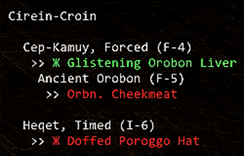
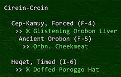

# PopTracker
 
Originally developed by Xurion, I felt an "update/expansion" was needed.
Changed the Name from "EmpyPopTracker" to just "PopTracker"
Changed command prefix from "//ept" to "//nm"
Added more forced pop NM's both inside and outside of Abyssea, and still adding NM's to trackable list.
Other than my changes, addon still works as intended and credit for concept and original work still go to Xurion.
https://github.com/xurion/ffxi-empy-pop-tracker
 
An FFXI Windower 4 addon that tracks items and key items for popping various NMs, such as Briareus, Apademak and Warder of Courage.

 

Originally developed to track Abyssea Empyrean weapon NMs, hence the name. Key items are identified by the Zhe (Ж) character. Treasure pool counts for pop items are listed in amber after the item in the format of [3] (assuming 3 of that item in the pool).

All text colours are configurable via the auto-generated settings.xml file.

## Installation

Download or clone the PopTracker.zip file and extract to Windower > Addons folder.

## Load

`//lua load poptracker`

## Track an NM

`//nm track glavoid` tracks Glavoid pop items/key items.

You can also track an NM by using a wildcard pattern, because fuck having to remember how to spell Itzpapalotl:

`//nm track itz*`

For a full list of trackable NMs, see the nms directory or use the `list` command (see below).

## Other Commands

### List Trackable NMs

`//nm list`

### Open BG Wiki for NM

`//nm bg`

### Hide UI

`//nm hide`

### Show UI

`//nm show`

### Toggle Mini Mode

`//nm mini`

### Toggle Collectable Item Display

`//nm collectables`

### Display Help

`//nm help`